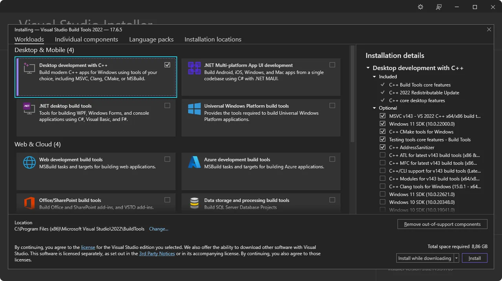

# windThemes

---

A simple app to automatically change themes on windows

## Instalation in windows

---

### Requriments

1. System Dependencies
   

2. Rust

```shell
winget install --id Rustlang.Rustup
rustup default stable-msvc

```

## Run

```shell
git clone https://github.com/sabuthess/windThemes.git

cd windThemes

bun install

bun tauri dev

```
